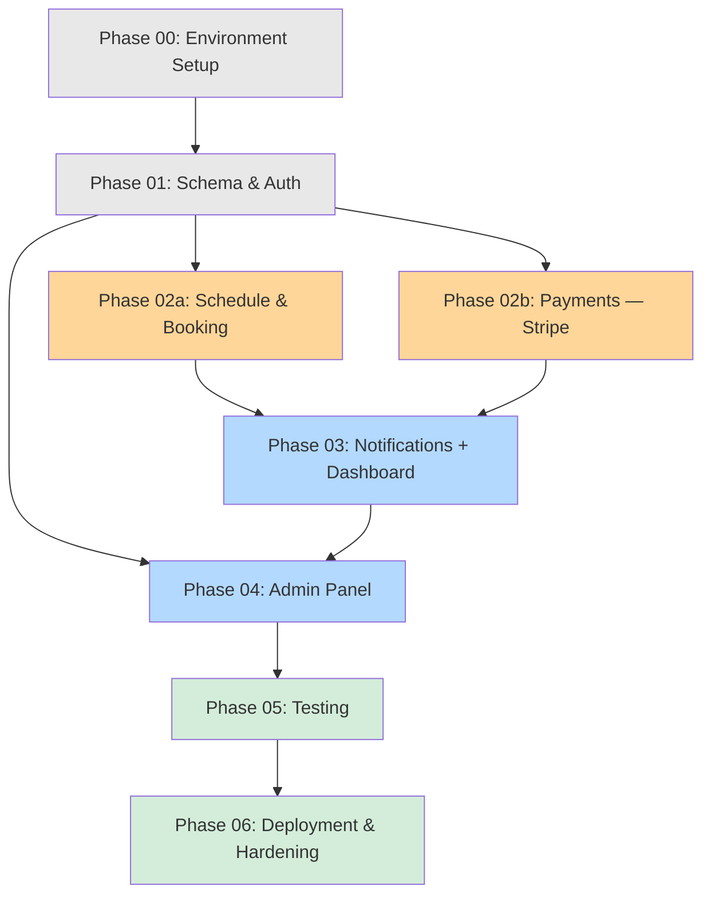

# BUILDPLAN: Maningo Method

**Spec Version:** v2 (LOCKED)
**SOW Reference:** maningo-method-sow.md
**Generated:** April 12, 2026
**Target Stack:** Next.js 14 / Supabase / Stripe / Resend / Docker / Hetzner
**Deployment Target:** maningo.hosthampton.com (Docker Compose on Hetzner VPS)
**Operator:** Claude Code

---

## Build Sequence



**Parallel-capable:** Phase 2a and Phase 2b can run simultaneously in separate Claude Code sessions — they share the schema from Phase 1 but don't touch each other's code. Phase 4 depends on Phase 3 (needs email templates for class cancellation).

---

## Phase Summary

| Phase | Name | Complexity | Est. Turns | --max-turns | Prerequisites | SOW Features | Operator File | Status |
|-------|------|-----------|------------|-------------|---------------|-------------|---------------|--------|
| 00 | Environment Setup | Low | 10-15 | 25 | None | — | `phase-00-environment.md` | ⬜ |
| 01 | Schema & Auth | Medium | 20-30 | 50 | Phase 00 | F-002 | `phase-01-foundation.md` | ⬜ |
| 02a | Schedule & Booking | High | 35-50 | 75 | Phase 01 | F-001, F-003, F-006, F-012 | `phase-02a-schedule-booking.md` | ⬜ |
| 02b | Payments (Stripe) | High | 35-50 | 75 | Phase 01 | F-004, F-005 | `phase-02b-payments.md` | ⬜ |
| 03 | Notifications + Dashboard | Medium | 25-35 | 50 | Phase 02a, 02b | F-007, F-008 | `phase-03-notifications-dashboard.md` | ⬜ |
| 04 | Admin Panel | Medium | 25-35 | 50 | Phase 03 | F-009, F-010, F-011 | `phase-04-admin.md` | ⬜ |
| 05 | Testing | Medium | 30-40 | 75 | Phase 04 | — | `phase-05-testing.md` | ⬜ |
| 06 | Deployment & Hardening | Medium | 20-30 | 50 | Phase 05 | — | `phase-06-deployment.md` | ⬜ |

**Total estimated turns:** 200-285
**Estimated wall-clock time:** 4-8 hours of active Claude Code execution (can be spread across days)

---

## Feature Traceability

| SOW Feature | Description | Build Phase | Spec Sections | Status |
|-------------|-------------|-------------|---------------|--------|
| F-001 | Public class schedule | Phase 2a | 2.2 (classes), 3.2 (GET /api/classes), 4.5.4 (mobile schedule) | ⬜ |
| F-002 | Student account creation | Phase 1 | 2.2 (profiles), 5.3 (Supabase Auth), 7.1 (auth flow) | ⬜ |
| F-003 | Class booking | Phase 2a | 2.2 (bookings, RPC), 3.2 (POST /api/bookings), 4.5.4 (mobile booking) | ⬜ |
| F-004 | Drop-in payment | Phase 2b | 2.2 (bookings), 3.2 (webhook), 5.1 (Stripe), 3.3 (webhook pattern) | ⬜ |
| F-005 | Monthly subscription | Phase 2b | 2.2 (subscriptions), 3.2 (subscription endpoints, webhook), 5.1 (Stripe) | ⬜ |
| F-006 | Capacity enforcement | Phase 2a | 2.2 (create_booking RPC), 3.2 (POST /api/bookings) | ⬜ |
| F-007 | Booking confirmation email | Phase 3 | 5.2 (Resend), emails/ templates | ⬜ |
| F-008 | Student dashboard | Phase 3 | 3.2 (GET /api/bookings, GET /me), 4.5.4 (mobile dashboard) | ⬜ |
| F-009 | Admin class management | Phase 4 | 3.2 (admin endpoints), 4.5.4 (admin mobile) | ⬜ |
| F-010 | Admin enrollment view | Phase 4 | 3.2 (GET enrollments) | ⬜ |
| F-011 | Admin student list | Phase 4 | 3.2 (GET /api/admin/students) | ⬜ |
| F-012 | Booking cancellation | Phase 2a | 3.2 (PATCH /api/bookings), 5.2 (cancellation email) | ⬜ |

---

## Phase Details

### Phase 00: Environment Setup
**Complexity:** Low | **Est. Turns:** 10-15 | **Prerequisites:** None
**Operator Prompt:** `maningo-method-phase-00-environment.md`

**Objective:** Initialize project with all infrastructure, tooling, and configuration so subsequent phases can build features immediately.

**Components Built:**
- [ ] Next.js 14 project scaffolding (TypeScript, Tailwind, App Router)
- [ ] Docker Compose config (single app container, port 3001)
- [ ] Dockerfile (multi-stage, standalone output)
- [ ] `.env.example` with all env vars from spec Section 7.3
- [ ] Supabase project initialization (`supabase init`)
- [ ] nginx server block for `maningo.hosthampton.com`
- [ ] pino logger setup (`src/lib/logger.ts`)
- [ ] Timezone utility (`src/lib/timezone.ts` — America/New_York)
- [ ] Supabase client utilities (browser, server, admin)
- [ ] Stripe lazy-init utility (`src/lib/stripe.ts`)
- [ ] Resend utility (`src/lib/resend.ts`)
- [ ] Base Tailwind config with mobile-first breakpoints
- [ ] Root layout with viewport meta, fonts, metadata

**Acceptance Criteria:**
- [ ] `docker compose up` starts container without errors
- [ ] App responds on port 3001 with Next.js default page
- [ ] Supabase connection succeeds (logger confirms)
- [ ] All env vars documented in `.env.example`
- [ ] Tailwind builds without errors
- [ ] `npm run build` succeeds in standalone mode

**Rollback:** Delete project directory, re-scaffold.

---

### Phase 01: Schema & Auth Foundation
**Complexity:** Medium | **Est. Turns:** 20-30 | **Prerequisites:** Phase 00
**Operator Prompt:** `maningo-method-phase-01-foundation.md`

**Objective:** Complete database schema and authentication system. After this phase, the data model supports all features and users can register, log in, and be authorized.

**Components Built:**
- [ ] Migration 001: profiles table + auth trigger (with stripe_customer_id, ON DELETE CASCADE)
- [ ] Migration 002: classes table (with completed status)
- [ ] Migration 003: bookings table + create_booking RPC + cleanup_pending_bookings fn (expanded status enum, payment fields, p_student_id param)
- [ ] Migration 004: subscriptions table
- [ ] Migration 005: processed_stripe_events table
- [ ] Migration 006: All RLS policies (exact SQL with WITH CHECK)
- [ ] Admin promotion script (`scripts/promote-admin.sql`)
- [ ] Auth pages: login, register, forgot-password (mobile-first)
- [ ] Auth middleware (session extraction, role checking)
- [ ] AuthGuard component
- [ ] Bottom tab navigation (MobileNav.tsx)
- [ ] Header component
- [ ] Feedback components (Skeleton, EmptyState, ErrorMessage, Toast)

**Acceptance Criteria:**
- [ ] All 6 migrations apply cleanly via `supabase db push`
- [ ] User can register → profile auto-created with role='student'
- [ ] User can log in, log out, reset password
- [ ] Password change revokes all other sessions
- [ ] Protected route redirects to /login without auth
- [ ] Admin route returns 403 for student role
- [ ] RLS prevents student from updating own role (test: UPDATE profiles SET role='admin')
- [ ] create_booking RPC works with explicit student_id param (no auth.uid)
- [ ] Bottom nav renders on mobile viewport

**Review Checkpoint:** CRITICAL — schema errors cascade. Verify every column, constraint, FK, ON DELETE, RLS policy matches spec Section 2.2 exactly.

**Rollback:** Drop all tables, re-run migrations.

---

### Phase 02a: Schedule & Booking
**Complexity:** High | **Est. Turns:** 35-50 | **Prerequisites:** Phase 01
**Operator Prompt:** `maningo-method-phase-02a-schedule-booking.md`

**Objective:** Students can browse the class schedule on mobile and book classes (subscription path). Drop-in payment redirect is wired but confirmation happens in Phase 2b.

**Components Built:**
- [ ] GET /api/classes (spots counts pending + confirmed)
- [ ] GET /api/classes/[id]
- [ ] POST /api/bookings (subscription confirmed, drop-in creates pending + returns placeholder)
- [ ] PATCH /api/bookings/[id] (cancel + email trigger hook)
- [ ] GET /api/bookings (end-time visibility logic)
- [ ] GET /api/cron/cleanup-pending
- [ ] Schedule page — mobile-first with day picker
- [ ] ClassCard, ClassSchedule, SpotsIndicator components
- [ ] BookingButton (all states: book, processing, booked, full, pending)
- [ ] Booking flow UI (bottom sheet for drop-in, instant for subscriber)
- [ ] Student booking list on dashboard (placeholder page, full dashboard in Phase 3)

**Acceptance Criteria:**
- [ ] Schedule displays upcoming classes with correct spot counts (pending + confirmed counted)
- [ ] Day picker works on mobile (horizontal scroll, tap to filter)
- [ ] Subscriber can book → status = confirmed → spot decremented
- [ ] Drop-in booking creates pending record + returns (Stripe URL placeholder OK — real Stripe in 2b)
- [ ] Cancel sets status=cancelled, frees spot
- [ ] Double-booking prevented (partial unique index works)
- [ ] Class at max capacity shows "Full" and disables booking
- [ ] Subscriber with 5+ active bookings gets MAX_BOOKINGS_REACHED error
- [ ] Cleanup function expires pending bookings older than 15 min
- [ ] Dashboard shows class until it ends (not when it starts)
- [ ] All components have loading skeletons and empty states
- [ ] Mobile viewport (375px) renders correctly — no horizontal scroll

**Rollback:** Git revert to Phase 01 tag. Bookings table data preserved via down migration.

---

### Phase 02b: Payments (Stripe)
**Complexity:** High | **Est. Turns:** 35-50 | **Prerequisites:** Phase 01
**Operator Prompt:** `maningo-method-phase-02b-payments.md`

**Objective:** Complete Stripe integration — drop-in checkout, subscription checkout, webhook handler for all 6 events, subscription lifecycle management.

**Components Built:**
- [ ] POST /api/subscriptions/checkout (Stripe Customer on profiles, mobile return URLs)
- [ ] GET /api/subscriptions/me
- [ ] POST /api/subscriptions/portal
- [ ] POST /api/webhooks/stripe (signature verification, idempotency, correct error responses)
- [ ] Webhook: checkout.session.completed (payment mode — pending → confirmed)
- [ ] Webhook: checkout.session.completed (subscription mode — create sub record)
- [ ] Webhook: customer.subscription.updated
- [ ] Webhook: customer.subscription.deleted (+ cancel future bookings)
- [ ] Webhook: invoice.payment_failed (+ cancel future bookings)
- [ ] Webhook: invoice.paid (recovery → active)
- [ ] POST /api/bookings drop-in path (creates Stripe Checkout Session, stores booking_id in metadata)
- [ ] Booking success page (/booking-success — handles both types)
- [ ] Subscription management page (/subscription)

**Acceptance Criteria:**
- [ ] Drop-in: Stripe Checkout → webhook → pending booking becomes confirmed, payment_intent_id stored
- [ ] Subscription: Stripe Checkout → webhook → subscription record created, customer_id on profiles
- [ ] Subscription cancel (via Portal) → webhook → status cancelled, future bookings cancelled
- [ ] invoice.payment_failed → status past_due, future bookings cancelled
- [ ] invoice.paid → status back to active
- [ ] Webhook returns 200 on success, 500 on DB failure, 400 on bad signature
- [ ] Duplicate webhook events are idempotent (processed_stripe_events check)
- [ ] Stripe test mode payments succeed end-to-end
- [ ] Mobile return URLs work on Safari (no popups)
- [ ] Success page shows correct confirmation for both payment types

**CAUTION:** Webhook handler MUST be idempotent and MUST return 500 on DB failure (not 200). This was a CRITICAL review finding. Body parsing must be disabled for the webhook route.

**Rollback:** Remove Stripe webhook endpoint in dashboard. Git revert. Subscription/payment data may need manual Stripe dashboard cleanup.

---

### Phase 03: Notifications + Student Dashboard
**Complexity:** Medium | **Est. Turns:** 25-35 | **Prerequisites:** Phase 02a, 02b
**Operator Prompt:** `maningo-method-phase-03-notifications-dashboard.md`

**Objective:** All email notifications working, student dashboard fully functional with booking list and subscription status.

**Components Built:**
- [ ] React Email templates (4): BookingConfirmation, BookingCancellation, ClassCancellation, SubscriptionBookingsCancelled
- [ ] Resend integration (single send + Batch API)
- [ ] Email triggers wired into: booking creation, booking cancellation, class cancellation, subscription loss
- [ ] Student dashboard page — mobile-first (UpcomingBookings + SubscriptionStatus)
- [ ] Subscription management page (subscribe CTA or Portal link)
- [ ] Refund report generation on admin class cancel (sends to admin email)

**Acceptance Criteria:**
- [ ] Booking triggers confirmation email within 60 seconds (includes studio address)
- [ ] Student cancellation triggers cancellation confirmation email
- [ ] Dashboard shows accurate booking list and subscription status
- [ ] Dashboard empty state shows "No upcoming classes" + CTA
- [ ] Subscription page: if no sub → subscribe CTA; if active → Portal link; if past_due → warning
- [ ] Mobile layout correct (375px)

**Rollback:** Git revert. Remove email trigger calls. Dashboard reverts to placeholder.

---

### Phase 04: Admin Panel
**Complexity:** Medium | **Est. Turns:** 25-35 | **Prerequisites:** Phase 03
**Operator Prompt:** `maningo-method-phase-04-admin.md`

**Objective:** Instructor can self-manage classes, view enrollments, and view student list without developer intervention.

**Components Built:**
- [ ] Admin layout (mobile bottom nav / desktop sidebar)
- [ ] POST /api/admin/classes
- [ ] PATCH /api/admin/classes/[id] (including cancel with batch email + refund report)
- [ ] DELETE /api/admin/classes/[id]
- [ ] GET /api/admin/classes
- [ ] GET /api/admin/classes/[id]/enrollments
- [ ] GET /api/admin/students
- [ ] ClassForm, ClassTable, EnrollmentList, StudentTable components
- [ ] Admin middleware on all admin routes

**Acceptance Criteria:**
- [ ] Admin can create class → appears on public schedule
- [ ] Admin can cancel class → students notified via batch email, refund report sent
- [ ] Admin can view enrollment roster (name, email, phone, payment type)
- [ ] Admin can view all students with subscription status
- [ ] Non-admin gets 403 on all admin endpoints
- [ ] Mobile card layout (not tables) on small viewports
- [ ] All components have empty states

**Rollback:** Git revert. Admin routes removed but schema unchanged.

---

### Phase 05: Testing
**Complexity:** Medium | **Est. Turns:** 30-40 | **Prerequisites:** Phase 04
**Operator Prompt:** `maningo-method-phase-05-testing.md`

**Objective:** Comprehensive test suite covering unit, integration, and E2E. Mobile viewport is primary E2E target.

**Components Built:**
- [ ] Vitest config + test setup (Supabase test DB)
- [ ] Unit tests: all Zod schemas, timezone helpers, utils, capacity logic
- [ ] Integration tests: all API endpoints, webhook handler (all 6 events), idempotency, pending cleanup, admin endpoints
- [ ] E2E tests (Playwright): 5 journeys — mobile schedule browse, mobile booking flow, subscription flow, admin class management, drop-in payment flow
- [ ] Test fixtures (factory functions)
- [ ] Test seed scripts

**Acceptance Criteria:**
- [ ] All unit tests pass
- [ ] All integration tests pass (including webhook idempotency + error response tests)
- [ ] All E2E journeys pass on Chromium at 375px viewport
- [ ] No test relies on shared mutable state
- [ ] `npm test` runs all unit + integration tests
- [ ] `npx playwright test` runs all E2E tests

**Rollback:** Delete test files. No production impact.

---

### Phase 06: Deployment & Hardening
**Complexity:** Medium | **Est. Turns:** 20-30 | **Prerequisites:** Phase 05
**Operator Prompt:** `maningo-method-phase-06-deployment.md`

**Objective:** Production-ready deployment on Hetzner VPS with monitoring, security headers, and operational tooling.

**Components Built:**
- [ ] Production Docker Compose (memory limits, restart policy)
- [ ] nginx production config (rate limiting, security headers, gzip, cache headers for static)
- [ ] GET /api/health (Supabase + basic checks)
- [ ] Input validation audit (Zod on every endpoint)
- [ ] Error handling consistency audit (all errors use spec Section 8.1 format)
- [ ] Cloudflare DNS record + SSL verification
- [ ] Stripe webhook registered in live mode
- [ ] Deployment script with migrations (spec Section 1.3)
- [ ] UptimeRobot setup on /api/health (also triggers cleanup cron)
- [ ] Cron secret configured

**Acceptance Criteria:**
- [ ] `maningo.hosthampton.com` loads with valid SSL
- [ ] Health check returns 200 with DB connected
- [ ] Rate limiting active (test: rapid requests return 429)
- [ ] Security headers present (CSP, X-Frame-Options, X-Content-Type-Options)
- [ ] All env vars set for production
- [ ] Stripe live webhook receives test event
- [ ] UptimeRobot confirms monitoring active
- [ ] Full deploy cycle works: git pull → migrate → rebuild → verify

**Rollback:** Revert Docker image. DNS unchanged. Stripe webhook can be paused.

---

## Execution Guidance

### Session Strategy

| Phase | --max-turns | Sessions Expected | Can Parallel? |
|-------|-------------|-------------------|---------------|
| 00 | 25 | 1 | No |
| 01 | 50 | 1, maybe 1 --continue | No |
| 02a | 75 | 1-2 --continue cycles | **Yes — with 02b** |
| 02b | 75 | 1-2 --continue cycles | **Yes — with 02a** |
| 03 | 50 | 1 | No |
| 04 | 50 | 1, maybe 1 --continue | No |
| 05 | 75 | 1-2 --continue cycles | No |
| 06 | 50 | 1 | No |

### Human Decision Points

1. **After Phase 00** — Verify project structure before building on it
2. **After Phase 01** — CRITICAL: Schema review. Test RLS policies manually. Verify admin role protection.
3. **After Phase 02a + 02b** — Test booking flow end-to-end with Stripe test mode
4. **After Phase 04** — Have instructor do a walkthrough of admin panel
5. **Before Phase 06 go-live** — Final sign-off on production readiness

### Phase Execution Workflow

```
1. Paste phase operator prompt into Claude Code
2. Run: claude --max-turns [N]
3. If hits limit: claude --continue
4. When complete: review completion report
5. Optional: paste review prompt into SEPARATE session
6. Verdict: PROMOTE → next phase | FIX → re-run | ESCALATE → human decides
```

---

## Risk Register

| Risk | Phase Affected | Mitigation |
|------|---------------|------------|
| Stripe webhook auth.uid() NULL | Phase 02b | Fixed in spec v2: RPC accepts p_student_id param |
| Drop-in race condition (pay but no spot) | Phase 02a/02b | Fixed in spec v2: pending booking reserves spot before checkout |
| RLS role escalation | Phase 01 | Fixed in spec v2: WITH CHECK (role = 'student') on update policy |
| Webhook idempotency failures | Phase 02b | processed_stripe_events table defined in schema |
| Mobile Safari Stripe redirect issues | Phase 02b | Full-page redirect (no popups), explicit success/cancel URLs |
| Schema migration missed on deploy | Phase 06 | Deploy script includes supabase db push step |
| Subscription loss orphans future bookings | Phase 02b | Webhook handlers cancel future subscription bookings |

---

## Rollback Strategy

| Phase | Rollback Approach | Data Impact |
|-------|------------------|-------------|
| 00 | Delete project, re-scaffold | None |
| 01 | Drop tables, re-migrate | Seed data only |
| 02a | Git revert to Phase 01 tag | Booking data lost (test only) |
| 02b | Git revert + pause Stripe webhook | Payment data in Stripe preserved |
| 03 | Git revert, remove email triggers | Email templates removed |
| 04 | Git revert, admin routes removed | No data impact |
| 05 | Delete test files | No production impact |
| 06 | Revert Docker config, keep DNS | Zero downtime if staged |
