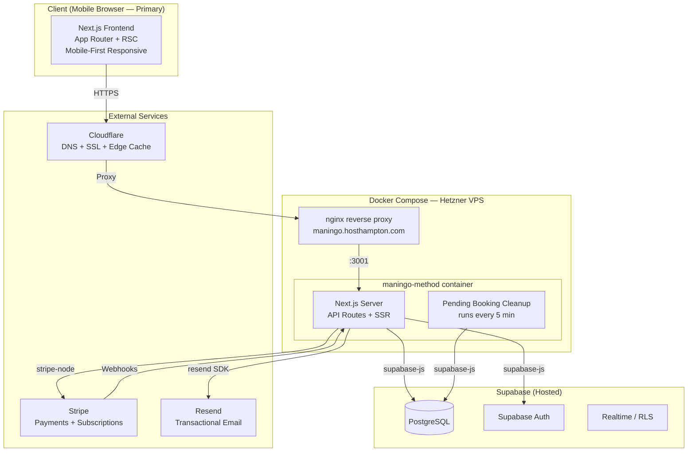
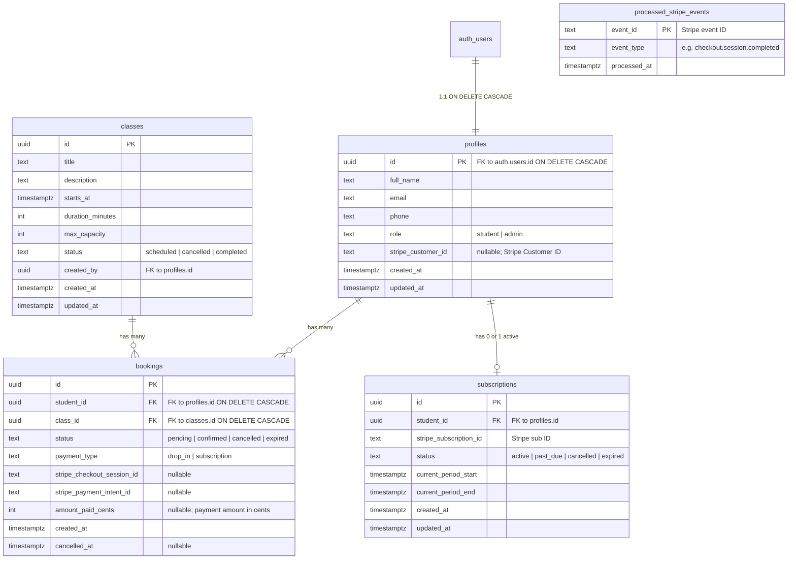
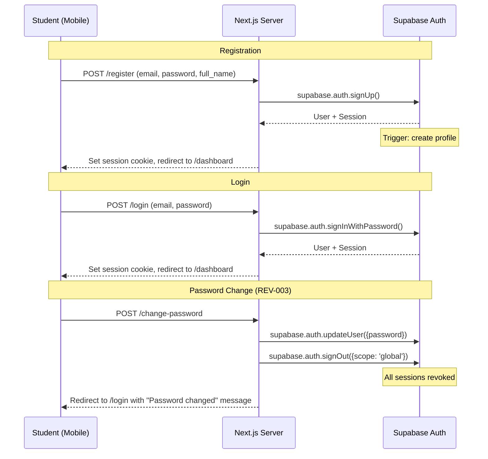

# Master Architecture Specification: Maningo Method
**Version:** 2
**SOW Reference:** maningo-method-sow.md
**Date:** April 12, 2026
**Status:** LOCKED
**Changelog:** v1 → v2: Incorporated 27 findings from adversarial review (Grok 4, Gemini 3.1 Pro, Claude/GPT). Added mobile-first UI specification (Section 4.5). See maningo-method-synthesis-v1.md for full decision gate.

---

## 1. System Architecture Overview

### 1.1 Architecture Diagram



### 1.2 Technology Stack

| Layer | Technology | Version | Rationale |
|-------|-----------|---------|-----------|
| Frontend | Next.js (App Router) | 14.x | Consistent with Host Hampton stack; RSC for fast schedule loading |
| UI Framework | Tailwind CSS | 3.x | Mobile-first utility classes; no component library overhead |
| Backend | Next.js API Routes | 14.x | Co-located with frontend; no separate server needed |
| Database | Supabase PostgreSQL | Latest | Managed Postgres with RLS, Auth, and real-time; existing infra |
| Auth | Supabase Auth | Latest | Built-in email/password; handles sessions, refresh, password reset |
| Payments | Stripe | API v2024+ | Separate instructor-owned account; Checkout Sessions + Subscriptions API |
| Email | Resend (+ Batch API) | Latest | Transactional booking confirmations; batch sends for class cancellation |
| Hosting | Hetzner VPS + Docker Compose | Ubuntu 24 | Existing infra; separate stack from Host Hampton |
| Reverse Proxy | nginx | Latest | Subdomain routing; SSL termination via Cloudflare |
| DNS/SSL | Cloudflare | — | Existing zone for hosthampton.com; subdomain + edge SSL |
| Validation | Zod | 3.x | Runtime type validation for API inputs and form data |
| Logging | pino | 9.x | Structured JSON logging with correlation IDs |
| Timezone | date-fns + date-fns-tz | Latest | Studio timezone enforcement on frontend |

### 1.3 Deployment Topology

The application runs as a single Docker container (`maningo-method-app`) within its own Docker Compose stack at `/opt/maningo-method/` on the shared Hetzner VPS. This is fully isolated from the Host Hampton stack at `/opt/hosthampton/`.

nginx listens on port 443 (SSL terminated by Cloudflare in Full mode) and routes `maningo.hosthampton.com` to the app container on port 3001. The container runs Next.js in standalone output mode.

Environment variables are stored in `/opt/maningo-method/.env` (not committed to git). The `.env.example` file documents all required variables.

**Deployment command (MVP):**
```bash
cd /opt/maningo-method
git pull origin main
npx supabase db push          # Apply pending migrations BEFORE app starts
docker compose up -d --build  # Rebuild and restart app container
docker compose logs -f --tail=50 maningo-method-app  # Verify healthy startup
```

**Rollback:** `git revert HEAD && docker compose up -d --build && npx supabase db push` (down migrations for each up migration).

Phase 2 can add a GitHub webhook deploy trigger + blue-green deployment.

---

## 2. Database Schema

### 2.1 Entity Relationship Diagram



### 2.2 Table Definitions

#### `profiles`
**Implements:** F-002
**Review fixes:** REV-004 (RLS role escalation), REV-007 (stripe_customer_id moved here), REV-011 (ON DELETE CASCADE), REV-014 (FK explicit)

| Column | Type | Constraints | Default | Description |
|--------|------|-------------|---------|-------------|
| id | uuid | PK, FK → auth.users.id **ON DELETE CASCADE** | — | Mirrors Supabase Auth user ID |
| full_name | text | NOT NULL | — | Student's display name |
| email | text | NOT NULL, UNIQUE | — | Denormalized from auth.users for query convenience |
| phone | text | NULL | — | Optional phone number |
| role | text | NOT NULL, CHECK (role IN ('student', 'admin')) | 'student' | User role for authorization |
| stripe_customer_id | text | NULL, UNIQUE | — | **Centralized** Stripe Customer ID — one per student regardless of subscription status |
| created_at | timestamptz | NOT NULL | now() | Account creation timestamp |
| updated_at | timestamptz | NOT NULL | now() | Last profile update |

**Indexes:**
- `idx_profiles_email` UNIQUE on `email` — Login lookups, duplicate prevention
- `idx_profiles_role` on `role` — Admin queries
- `idx_profiles_stripe_customer` UNIQUE on `stripe_customer_id` WHERE `stripe_customer_id IS NOT NULL` — Stripe lookups

**RLS Policies (exact SQL):**
```sql
-- Students read their own profile
CREATE POLICY "profiles_select_own" ON profiles
  FOR SELECT USING (auth.uid() = id);

-- Admin reads all profiles
CREATE POLICY "profiles_select_admin" ON profiles
  FOR SELECT USING (
    EXISTS (SELECT 1 FROM profiles WHERE id = auth.uid() AND role = 'admin')
  );

-- Students update their own profile — CANNOT change role (REV-004 fix)
CREATE POLICY "profiles_update_own" ON profiles
  FOR UPDATE USING (auth.uid() = id)
  WITH CHECK (role = 'student');

-- Admin can update any profile
CREATE POLICY "profiles_update_admin" ON profiles
  FOR UPDATE USING (
    EXISTS (SELECT 1 FROM profiles WHERE id = auth.uid() AND role = 'admin')
  );

-- Insert handled by trigger only (SECURITY DEFINER)
-- No direct INSERT policy for anon/authenticated roles
```

**Trigger:**
```sql
-- Auto-create profile on Supabase Auth signup
CREATE OR REPLACE FUNCTION public.handle_new_user()
RETURNS trigger AS $$
BEGIN
  INSERT INTO public.profiles (id, full_name, email, role)
  VALUES (
    NEW.id,
    COALESCE(NEW.raw_user_meta_data->>'full_name', ''),
    NEW.email,
    'student'
  );
  RETURN NEW;
END;
$$ LANGUAGE plpgsql SECURITY DEFINER;

CREATE TRIGGER on_auth_user_created
  AFTER INSERT ON auth.users
  FOR EACH ROW EXECUTE FUNCTION public.handle_new_user();
```

---

#### `classes`
**Implements:** F-001, F-006, F-009
**Review fixes:** REV-024 (completed status)

| Column | Type | Constraints | Default | Description |
|--------|------|-------------|---------|-------------|
| id | uuid | PK | gen_random_uuid() | Class instance identifier |
| title | text | NOT NULL | — | Class name (e.g., "Mat Pilates", "Reformer Basics") |
| description | text | NULL | — | Optional class description |
| starts_at | timestamptz | NOT NULL | — | Class start date/time |
| duration_minutes | integer | NOT NULL, CHECK (> 0) | 60 | Class length |
| max_capacity | integer | NOT NULL, CHECK (> 0) | 16 | Maximum students allowed |
| status | text | NOT NULL, CHECK (status IN ('scheduled', 'cancelled', **'completed'**)) | 'scheduled' | Class status |
| created_by | uuid | FK → profiles.id | — | Admin who created the class |
| created_at | timestamptz | NOT NULL | now() | Record creation time |
| updated_at | timestamptz | NOT NULL | now() | Last update time |

**Indexes:**
- `idx_classes_starts_at` on `starts_at` — Schedule queries
- `idx_classes_status_starts_at` on `(status, starts_at)` — Filtered schedule: active future classes

**RLS Policies:**
- Public can SELECT classes (no auth required for browsing schedule)
- Admin can INSERT, UPDATE, DELETE (role check via profiles subquery)

---

#### `bookings`
**Implements:** F-003, F-006, F-012
**Review fixes:** REV-002 (pending state), REV-010 (expanded status enum), REV-011 (ON DELETE CASCADE), REV-017 (max concurrent bookings), REV-019 (indexes), REV-023 (payment fields)

| Column | Type | Constraints | Default | Description |
|--------|------|-------------|---------|-------------|
| id | uuid | PK | gen_random_uuid() | Booking identifier |
| student_id | uuid | NOT NULL, FK → profiles.id **ON DELETE CASCADE** | — | Who booked |
| class_id | uuid | NOT NULL, FK → classes.id **ON DELETE CASCADE** | — | Which class |
| status | text | NOT NULL, CHECK (status IN (**'pending'**, 'confirmed', 'cancelled', **'expired'**)) | **'pending'** | Booking lifecycle state |
| payment_type | text | NOT NULL, CHECK (payment_type IN ('drop_in', 'subscription')) | — | How this was paid for |
| stripe_checkout_session_id | text | NULL | — | Stripe Checkout Session ID (drop-in only) |
| stripe_payment_intent_id | text | NULL | — | Stripe PaymentIntent ID for audit/reconciliation |
| amount_paid_cents | integer | NULL | — | Payment amount in cents (3500 = $35.00) |
| created_at | timestamptz | NOT NULL | now() | Booking time |
| cancelled_at | timestamptz | NULL | — | When cancelled (if applicable) |

**Indexes:**
- `idx_bookings_class_id_status` on `(class_id, status)` — Enrollment count queries
- `idx_bookings_student_id_status` on `(student_id, status)` — Student dashboard + concurrent booking check
- `uniq_bookings_student_class` UNIQUE on `(student_id, class_id)` WHERE `status IN ('pending', 'confirmed')` — Prevent double-booking (includes pending)
- `idx_bookings_pending_cleanup` on `(status, created_at)` WHERE `status = 'pending'` — Cleanup job index

**Booking Status Lifecycle:**
```
pending → confirmed     (webhook payment success / subscription validation)
pending → expired       (cleanup job: pending > 15 minutes)
confirmed → cancelled   (student cancels / admin cancels class / subscription revoked)
```

**RLS Policies:**
- Students can SELECT their own bookings
- Students can UPDATE their own bookings (cancel only: status → 'cancelled')
- Admin can SELECT all bookings
- INSERT/UPDATE for service_role (webhook-driven) bypasses RLS

**Capacity Enforcement (RPC Function):**
**Review fixes:** REV-001 (p_student_id param for webhook context), REV-002 (count pending + confirmed), REV-017 (max concurrent check)

```sql
-- Atomic booking with capacity check
-- Accepts optional p_student_id for webhook (service_role) context where auth.uid() is NULL
CREATE OR REPLACE FUNCTION public.create_booking(
  p_class_id uuid,
  p_payment_type text,
  p_stripe_checkout_session_id text DEFAULT NULL,
  p_stripe_payment_intent_id text DEFAULT NULL,
  p_amount_paid_cents integer DEFAULT NULL,
  p_student_id uuid DEFAULT NULL,                    -- REV-001: explicit student ID for webhook calls
  p_status text DEFAULT 'confirmed'                  -- REV-002: allow 'pending' for drop-in pre-checkout
)
RETURNS uuid AS $$
DECLARE
  v_booking_id uuid;
  v_current_count integer;
  v_max_capacity integer;
  v_class_status text;
  v_effective_student_id uuid;
  v_active_booking_count integer;
  v_max_concurrent_bookings integer := 5;            -- REV-017: configurable limit per subscriber
BEGIN
  -- REV-001: Use provided student_id (webhook context) or auth.uid() (direct call)
  v_effective_student_id := COALESCE(p_student_id, auth.uid());

  IF v_effective_student_id IS NULL THEN
    RAISE EXCEPTION 'AUTH_REQUIRED';
  END IF;

  -- Lock the class row to prevent race conditions
  SELECT max_capacity, status INTO v_max_capacity, v_class_status
  FROM public.classes
  WHERE id = p_class_id
  FOR UPDATE;

  IF v_class_status IS NULL THEN
    RAISE EXCEPTION 'CLASS_NOT_FOUND';
  END IF;

  IF v_class_status = 'cancelled' THEN
    RAISE EXCEPTION 'CLASS_CANCELLED';
  END IF;

  -- REV-002: Count pending + confirmed bookings for capacity
  SELECT COUNT(*) INTO v_current_count
  FROM public.bookings
  WHERE class_id = p_class_id AND status IN ('pending', 'confirmed');

  IF v_current_count >= v_max_capacity THEN
    RAISE EXCEPTION 'CLASS_FULL';
  END IF;

  -- Check for existing booking by this student (pending or confirmed)
  IF EXISTS (
    SELECT 1 FROM public.bookings
    WHERE class_id = p_class_id
      AND student_id = v_effective_student_id
      AND status IN ('pending', 'confirmed')
  ) THEN
    RAISE EXCEPTION 'ALREADY_BOOKED';
  END IF;

  -- REV-017: Check max concurrent active bookings for subscribers
  IF p_payment_type = 'subscription' THEN
    SELECT COUNT(*) INTO v_active_booking_count
    FROM public.bookings b
    JOIN public.classes c ON b.class_id = c.id
    WHERE b.student_id = v_effective_student_id
      AND b.status IN ('pending', 'confirmed')
      AND c.starts_at > now();

    IF v_active_booking_count >= v_max_concurrent_bookings THEN
      RAISE EXCEPTION 'MAX_BOOKINGS_REACHED';
    END IF;
  END IF;

  -- Create the booking
  INSERT INTO public.bookings (
    student_id, class_id, status, payment_type,
    stripe_checkout_session_id, stripe_payment_intent_id, amount_paid_cents
  )
  VALUES (
    v_effective_student_id, p_class_id, p_status, p_payment_type,
    p_stripe_checkout_session_id, p_stripe_payment_intent_id, p_amount_paid_cents
  )
  RETURNING id INTO v_booking_id;

  RETURN v_booking_id;
END;
$$ LANGUAGE plpgsql SECURITY DEFINER;
```

**Pending Booking Cleanup Function (REV-002):**
```sql
-- Run via cron every 5 minutes: expire abandoned pending bookings
CREATE OR REPLACE FUNCTION public.cleanup_pending_bookings()
RETURNS integer AS $$
DECLARE
  v_expired_count integer;
BEGIN
  UPDATE public.bookings
  SET status = 'expired'
  WHERE status = 'pending'
    AND created_at < now() - interval '15 minutes'
  RETURNING COUNT(*) INTO v_expired_count;

  RETURN v_expired_count;
END;
$$ LANGUAGE plpgsql SECURITY DEFINER;
```

The Next.js app calls this via a self-invoking API route (`GET /api/cron/cleanup-pending`) triggered by an internal setInterval or external cron (UptimeRobot hitting the endpoint every 5 minutes with a secret query param).

---

#### `subscriptions`
**Implements:** F-005
**Review fixes:** REV-007 (stripe_customer_id moved to profiles)

| Column | Type | Constraints | Default | Description |
|--------|------|-------------|---------|-------------|
| id | uuid | PK | gen_random_uuid() | Record identifier |
| student_id | uuid | NOT NULL, FK → profiles.id, UNIQUE | — | One sub per student |
| stripe_subscription_id | text | NOT NULL, UNIQUE | — | Stripe Subscription object ID |
| status | text | NOT NULL, CHECK (status IN ('active', 'past_due', 'cancelled', 'expired')) | — | Mirrors Stripe sub status |
| current_period_start | timestamptz | NOT NULL | — | Current billing period start |
| current_period_end | timestamptz | NOT NULL | — | Current billing period end |
| created_at | timestamptz | NOT NULL | now() | Subscription creation time |
| updated_at | timestamptz | NOT NULL | now() | Last status sync |

**Note:** `stripe_customer_id` is now on `profiles` table (REV-007). This prevents duplicate Stripe Customers when users re-subscribe or use drop-in after subscription cancellation.

**Indexes:**
- `idx_subscriptions_student_id` UNIQUE on `student_id`
- `idx_subscriptions_stripe_sub_id` UNIQUE on `stripe_subscription_id`

**RLS Policies:**
- Students can SELECT their own subscription
- No direct INSERT/UPDATE from client — all writes via webhook handler (service_role)

---

#### `processed_stripe_events` (NEW — REV-005)
**Implements:** Webhook idempotency

| Column | Type | Constraints | Default | Description |
|--------|------|-------------|---------|-------------|
| event_id | text | **PK** | — | Stripe event ID (globally unique) |
| event_type | text | NOT NULL | — | e.g., `checkout.session.completed` |
| processed_at | timestamptz | NOT NULL | now() | When the event was processed |

**No RLS** — only accessed via service_role in webhook handler.

### 2.3 Migrations Strategy

Use Supabase CLI migrations (`supabase migration new`, `supabase db push`). All migrations are idempotent SQL files stored in `supabase/migrations/`. Every up migration has a corresponding down migration for rollback.

**Migration order (v2):**
1. `001_create_profiles.sql` — profiles table (with stripe_customer_id) + auth trigger
2. `002_create_classes.sql` — classes table (with 'completed' status)
3. `003_create_bookings.sql` — bookings table (expanded status enum, payment fields) + create_booking RPC + cleanup_pending_bookings function
4. `004_create_subscriptions.sql` — subscriptions table (no stripe_customer_id)
5. `005_create_processed_events.sql` — processed_stripe_events table
6. `006_rls_policies.sql` — All RLS policies (explicit WITH CHECK clauses)

**REV-013:** Migrations MUST run before the app container starts accepting traffic. See deployment command in Section 1.3.

### 2.4 Seed Data

**REV-012:** Admin role assignment is NOT done via a repeatable migration. Instead:
1. Instructor registers normally via the signup flow (creates auth.users + profiles row with role='student').
2. Adam runs a **one-time Supabase admin API script** to promote the instructor to admin:
```sql
-- Run once via Supabase SQL editor or CLI. NOT a migration file.
UPDATE profiles SET role = 'admin' WHERE email = 'instructor@example.com';
```
3. This change is logged in the project changelog for audit trail.

**Dev/test seed data:**
- 3-5 sample classes for the next 2 weeks
- 2 test students (one with subscription, one without)
- 3-4 sample bookings
- 1 admin user

---

## 3. API Design

### 3.1 API Conventions

- **Base path:** `/api` (Next.js App Router convention)
- **Auth:** Supabase Auth JWT passed via session cookie. The Next.js API route extracts the user via `@supabase/ssr` cookie helper.
- **Content-Type:** `application/json`
- **Error format:**
```json
{
  "error": {
    "code": "CLASS_FULL",
    "message": "This class has reached maximum capacity."
  }
}
```
- **Date format:** ISO 8601 with timezone (`2026-04-15T09:00:00-04:00`)
- **Timezone convention (REV-014):** All dates stored as `timestamptz` in UTC. All API responses include timezone offset. **Frontend MUST render all times in studio timezone (`America/New_York`)** using `date-fns-tz`. A class at 9:00 AM EDT displays as 9:00 AM regardless of the user's browser timezone.
- **Pagination:** Not needed for MVP. Cursor-based pagination in Phase 2.
- **Rate limiting:** Public endpoints: 10 req/sec per IP. Auth endpoints: 5 req/min per IP.
- **Request logging (REV-015):** All requests logged via `pino` with: method, path, status, duration_ms, correlation_id. PII (email, phone, auth tokens) is NEVER logged.

### 3.2 Endpoint Definitions

#### Classes (Public) — Implements F-001

##### `GET /api/classes`
**Purpose:** Fetch upcoming scheduled classes with enrollment counts.
**Auth:** Public (no auth required)

**Query Parameters:**
- `from` (optional, ISO date) — Start of date range. Defaults to `now()`.
- `to` (optional, ISO date) — End of date range. Defaults to 14 days from `from`.

**Response (200):**
```json
{
  "classes": [
    {
      "id": "uuid",
      "title": "Mat Pilates",
      "description": "A full-body mat class...",
      "starts_at": "2026-04-15T09:00:00-04:00",
      "duration_minutes": 60,
      "max_capacity": 16,
      "spots_remaining": 12,
      "status": "scheduled"
    }
  ]
}
```

**Implementation note:** `spots_remaining` is computed as `max_capacity - COUNT(bookings WHERE status IN ('pending', 'confirmed'))`. This counts pending (in-checkout) bookings against capacity (REV-002).

##### `GET /api/classes/[id]`
**Purpose:** Fetch a single class with full details.
**Auth:** Public
**Error Responses:** `404` — Class not found

---

#### Bookings — Implements F-003, F-012

##### `POST /api/bookings`
**Purpose:** Create a booking for the authenticated student.
**Auth:** Required (student)

**Request:**
```json
{
  "class_id": "uuid",
  "payment_type": "subscription | drop_in"
}
```

**Logic (REV-002 revised flow):**

1. **If `payment_type === 'subscription'`:**
   - Verify student has active subscription (`status = 'active'` AND `current_period_end > now()` — OR `current_period_end` covers the class `starts_at` date per REV-005 business logic).
   - Call `create_booking()` RPC with `p_status = 'confirmed'` directly.
   - Return booking.

2. **If `payment_type === 'drop_in'` (REV-002 revised):**
   - Call `create_booking()` RPC with `p_status = 'pending'`. This **reserves the spot** before payment.
   - Create Stripe Checkout Session for $35 with metadata: `{ student_id, class_id, booking_id }`.
   - Return Checkout URL.
   - If Stripe Checkout creation fails, delete the pending booking.
   - The pending booking expires after 15 minutes if checkout is abandoned (cleanup job).

**Response (200) — Subscription booking:**
```json
{
  "booking": {
    "id": "uuid",
    "class_id": "uuid",
    "status": "confirmed",
    "payment_type": "subscription"
  }
}
```

**Response (200) — Drop-in (redirect to Stripe):**
```json
{
  "booking_id": "uuid",
  "checkout_url": "https://checkout.stripe.com/c/pay/..."
}
```

**Error Responses:**
- `400` — `CLASS_FULL`, `ALREADY_BOOKED`, `CLASS_CANCELLED`, `INVALID_PAYMENT_TYPE`, `MAX_BOOKINGS_REACHED`
- `401` — Not authenticated
- `402` — `NO_ACTIVE_SUBSCRIPTION`
- `404` — `CLASS_NOT_FOUND`

---

##### `GET /api/bookings`
**Purpose:** List the authenticated student's bookings.
**Auth:** Required (student)

**Query Parameters:**
- `status` (optional) — Filter by `confirmed`, `cancelled`, `pending`. Default: `confirmed`.
- `upcoming` (optional, boolean) — If `true`, only classes where **`starts_at + (duration_minutes * interval '1 minute') > now()`** (REV-018: class visible until it ends, not when it starts). Default: `true`.

**Response (200):**
```json
{
  "bookings": [
    {
      "id": "uuid",
      "class_id": "uuid",
      "class_title": "Mat Pilates",
      "class_starts_at": "2026-04-15T09:00:00-04:00",
      "class_duration_minutes": 60,
      "status": "confirmed",
      "payment_type": "subscription",
      "created_at": "2026-04-10T14:30:00-04:00"
    }
  ]
}
```

**Implementation note:** `class_title`, `class_starts_at`, `class_duration_minutes` require a JOIN to the `classes` table. This is explicitly documented — not stored on bookings.

---

##### `PATCH /api/bookings/[id]`
**Purpose:** Cancel a booking.
**Auth:** Required (student, own booking only)

**Request:**
```json
{ "status": "cancelled" }
```

**Logic:** Sets `status = 'cancelled'` and `cancelled_at = now()`. Frees the spot.

**REV-020:** On successful cancellation, sends a **cancellation confirmation email** to the student via Resend (confirms their spot has been released).

**No refund logic for MVP.** Cancellation policy deferred per SOW.

**Error Responses:**
- `401` — Not authenticated
- `403` — Not the student's booking
- `404` — Booking not found
- `409` — Booking already cancelled

---

#### Subscriptions — Implements F-005

##### `POST /api/subscriptions/checkout`
**Purpose:** Create a Stripe Checkout Session for the $95/month subscription.
**Auth:** Required (student)

**Logic (REV-007 revised):**
1. Check if student already has an active subscription → return `409 ALREADY_SUBSCRIBED`.
2. Look up `stripe_customer_id` from **`profiles`** table (not subscriptions).
3. If no Stripe Customer exists, create one. Save the ID to `profiles.stripe_customer_id`.
4. Create Stripe Checkout Session in `subscription` mode.
5. Return Checkout URL.

**Stripe Checkout `success_url` and `cancel_url` (REV-027):**
```
success_url: https://maningo.hosthampton.com/booking-success?type=subscription&session_id={CHECKOUT_SESSION_ID}
cancel_url:  https://maningo.hosthampton.com/subscription?cancelled=true
```
Both URLs must work correctly on mobile Safari (no custom schemes, no popups).

**Response (200):**
```json
{ "checkout_url": "https://checkout.stripe.com/c/pay/..." }
```

##### `GET /api/subscriptions/me`
**Purpose:** Get subscription status.
**Auth:** Required

**Response (200):**
```json
{
  "subscription": {
    "status": "active",
    "current_period_end": "2026-05-12T00:00:00-04:00"
  }
}
```

##### `POST /api/subscriptions/portal`
**Purpose:** Stripe Customer Portal session for self-service management.
**Auth:** Required (student with subscription)

**Response (200):**
```json
{ "portal_url": "https://billing.stripe.com/p/session/..." }
```

---

#### Stripe Webhooks — Implements F-004, F-005

##### `POST /api/webhooks/stripe`
**Purpose:** Handle Stripe webhook events.
**Auth:** Stripe webhook signature verification (no JWT).
**Supabase client:** `service_role` key (bypasses RLS).

**Events handled (REV-006, REV-009 revised):**

| Event | Action |
|-------|--------|
| `checkout.session.completed` (mode: payment) | Update pending booking to `confirmed`. Store `payment_intent_id` and `amount_paid_cents`. |
| `checkout.session.completed` (mode: subscription) | Create/update subscription record. Set status to `active`. Store customer ID on profiles if missing. |
| `customer.subscription.updated` | Update subscription status, period dates. Handle `past_due` → `active` transitions. |
| `customer.subscription.deleted` | Set subscription status to `cancelled`. **Cancel all future subscription bookings for this student (REV-008).** |
| `invoice.payment_failed` | Set subscription status to `past_due`. **Cancel all future subscription bookings (REV-008).** Send email notification to student. |
| **`invoice.paid` (REV-009)** | **Update subscription status back to `active`. Restore `current_period_end`. Handles payment recovery after failed invoice.** |

**Idempotency (REV-005):**
```
1. Check processed_stripe_events for event.id
2. If exists → return 200 immediately (already processed)
3. If not → process event → INSERT into processed_stripe_events → return 200
```

**Error handling (REV-006):**
```
- On signature verification failure → return 400
- On successful processing → INSERT event, return 200
- On DB failure during processing → DO NOT insert event, return 500
  (Stripe will retry. The event will be reprocessed on next attempt.)
- On idempotency check failure → return 500 (safe to retry)
```

**REV-008 — Future booking cancellation on subscription loss:**
When `customer.subscription.deleted` or `invoice.payment_failed` fires:
```sql
UPDATE bookings
SET status = 'cancelled', cancelled_at = now()
WHERE student_id = [student_id]
  AND payment_type = 'subscription'
  AND status = 'confirmed'
  AND class_id IN (SELECT id FROM classes WHERE starts_at > now());
```
Send batch cancellation email to the student listing all affected classes.

**Metadata passing:** Checkout Sessions include metadata:
- `student_id` (uuid)
- `class_id` (uuid) — for drop-in
- `booking_id` (uuid) — for drop-in (REV-002: to update pending → confirmed)

---

#### Cron — Internal

##### `GET /api/cron/cleanup-pending`
**Purpose:** Expire abandoned pending bookings.
**Auth:** Secret query parameter (`?key=CRON_SECRET`).

**Logic:** Calls `cleanup_pending_bookings()` RPC. Returns count of expired bookings. Triggered by external cron (UptimeRobot) every 5 minutes.

---

#### Admin Endpoints — Implements F-009, F-010, F-011

All admin endpoints require `role = 'admin'`. Middleware verifies via profiles subquery.

##### `POST /api/admin/classes`
**Purpose:** Create a new class.
**Auth:** Admin only

**Request:**
```json
{
  "title": "Mat Pilates",
  "description": "Optional description",
  "starts_at": "2026-04-20T09:00:00-04:00",
  "duration_minutes": 60,
  "max_capacity": 16
}
```

**Validation (Zod):**
- `title`: string, 1-100 chars, required
- `starts_at`: ISO datetime, must be in the future, required
- `duration_minutes`: integer, 15-180, required
- `max_capacity`: integer, 1-30, required
- `description`: string, 0-500 chars, optional

**Response (201):**
```json
{ "class": { "id": "uuid", "title": "...", "starts_at": "...", "..." : "..." } }
```

##### `PATCH /api/admin/classes/[id]`
**Purpose:** Update or cancel a class.
**Auth:** Admin only

**Special case — cancelling a class (REV-021, REV-022):**
1. Set class `status = 'cancelled'`
2. Cancel all confirmed + pending bookings for this class
3. **Use Resend Batch API** to notify all affected students in a single request (REV-021)
4. **Generate refund report (REV-022):** For any drop-in bookings in the cancelled set, compile a list of `{student_name, student_email, stripe_payment_intent_id, amount_paid_cents}` and send it to the admin email for manual Stripe refund processing.

##### `DELETE /api/admin/classes/[id]`
**Purpose:** Delete a class. Only allowed if no confirmed or pending bookings exist.
**Auth:** Admin only
**Error:** `409 HAS_ACTIVE_BOOKINGS`

##### `GET /api/admin/classes`
**Purpose:** List all classes (including past, cancelled, completed) for admin.
**Auth:** Admin only

##### `GET /api/admin/classes/[id]/enrollments`
**Purpose:** Class roster.
**Auth:** Admin only

**Response (200):**
```json
{
  "class_id": "uuid",
  "class_title": "Mat Pilates",
  "starts_at": "2026-04-15T09:00:00-04:00",
  "max_capacity": 16,
  "enrollments": [
    {
      "booking_id": "uuid",
      "student_name": "Sarah Johnson",
      "student_email": "sarah@example.com",
      "student_phone": "631-555-1234",
      "payment_type": "subscription",
      "status": "confirmed",
      "booked_at": "2026-04-10T14:30:00-04:00"
    }
  ]
}
```

##### `GET /api/admin/students`
**Purpose:** List all students with subscription status.
**Auth:** Admin only

##### `GET /api/health`
**Purpose:** Health check. Checks Supabase connection.
**Auth:** Public
**Response:** `{ "status": "ok", "timestamp": "...", "db": "connected" }`

---

### 3.3 Webhook Handler Implementation Pattern

**REV-001, REV-005, REV-006 consolidated:**

```
1. Parse raw body (body parsing DISABLED for this route)
2. Verify Stripe signature → fail = return 400
3. Extract event.id and event.type
4. Check processed_stripe_events for event.id → if exists, return 200 (idempotent)
5. Switch on event.type:
   a. Process business logic (using service_role Supabase client)
   b. On DB/processing error → log error with pino → return 500 (Stripe retries)
6. INSERT INTO processed_stripe_events (event.id, event.type)
7. Return 200
```

**Metadata passing:** Checkout Sessions include `student_id`, `class_id`, `booking_id` in metadata. Available in `checkout.session.completed` event for creating/updating bookings without a user session.

---

## 4. Component Architecture

### 4.1 Project Structure

```
maningo-method/
├── docker-compose.yml
├── Dockerfile
├── .env.example
├── next.config.js
├── tailwind.config.js
├── tsconfig.json
├── package.json
├── supabase/
│   ├── config.toml
│   └── migrations/
│       ├── 001_create_profiles.sql
│       ├── 002_create_classes.sql
│       ├── 003_create_bookings.sql
│       ├── 004_create_subscriptions.sql
│       ├── 005_create_processed_events.sql
│       └── 006_rls_policies.sql
├── scripts/
│   └── promote-admin.sql            — One-time admin role assignment (REV-012)
├── src/
│   ├── app/
│   │   ├── layout.tsx                    — Root layout: fonts, metadata, viewport, Supabase provider
│   │   ├── page.tsx                      — Landing page (hero + value prop + CTA)
│   │   ├── schedule/
│   │   │   └── page.tsx                  — Public class schedule (F-001)
│   │   ├── (auth)/
│   │   │   ├── login/page.tsx            — Login form (F-002)
│   │   │   ├── register/page.tsx         — Registration form (F-002)
│   │   │   └── forgot-password/page.tsx  — Password reset (F-002)
│   │   ├── (student)/
│   │   │   ├── layout.tsx                — Auth-protected layout with mobile nav
│   │   │   ├── dashboard/page.tsx        — Student dashboard (F-008)
│   │   │   ├── booking/[classId]/page.tsx — Booking flow (F-003)
│   │   │   └── subscription/page.tsx     — Subscription management (F-005)
│   │   ├── (admin)/
│   │   │   ├── layout.tsx                — Admin-protected layout with sidebar/bottom nav
│   │   │   ├── admin/page.tsx            — Admin dashboard overview
│   │   │   ├── admin/classes/page.tsx     — Class management list (F-009)
│   │   │   ├── admin/classes/new/page.tsx — Create class form (F-009)
│   │   │   ├── admin/classes/[id]/page.tsx — Edit class + enrollment view (F-009, F-010)
│   │   │   └── admin/students/page.tsx    — Student list (F-011)
│   │   ├── booking-success/page.tsx      — Post-payment success page
│   │   └── api/
│   │       ├── classes/route.ts
│   │       ├── classes/[id]/route.ts
│   │       ├── bookings/route.ts
│   │       ├── bookings/[id]/route.ts
│   │       ├── subscriptions/checkout/route.ts
│   │       ├── subscriptions/me/route.ts
│   │       ├── subscriptions/portal/route.ts
│   │       ├── webhooks/stripe/route.ts
│   │       ├── cron/cleanup-pending/route.ts
│   │       ├── health/route.ts
│   │       └── admin/
│   │           ├── classes/route.ts
│   │           ├── classes/[id]/route.ts
│   │           ├── classes/[id]/enrollments/route.ts
│   │           └── students/route.ts
│   ├── components/
│   │   ├── ui/                           — Shared primitives (see Section 4.5)
│   │   ├── schedule/
│   │   │   ├── ClassCard.tsx
│   │   │   ├── ClassSchedule.tsx
│   │   │   └── SpotsIndicator.tsx
│   │   ├── booking/
│   │   │   ├── BookingButton.tsx
│   │   │   └── BookingConfirmation.tsx
│   │   ├── dashboard/
│   │   │   ├── UpcomingBookings.tsx
│   │   │   └── SubscriptionStatus.tsx
│   │   ├── admin/
│   │   │   ├── ClassForm.tsx
│   │   │   ├── ClassTable.tsx
│   │   │   ├── EnrollmentList.tsx
│   │   │   └── StudentTable.tsx
│   │   ├── auth/
│   │   │   ├── LoginForm.tsx
│   │   │   ├── RegisterForm.tsx
│   │   │   └── AuthGuard.tsx
│   │   ├── layout/
│   │   │   ├── Header.tsx
│   │   │   ├── MobileNav.tsx             — Bottom tab navigation (mobile)
│   │   │   ├── Footer.tsx
│   │   │   └── AdminSidebar.tsx
│   │   └── feedback/                     — REV-016: Shared feedback components
│   │       ├── Skeleton.tsx              — Loading skeletons
│   │       ├── EmptyState.tsx            — Empty state with icon + message + CTA
│   │       ├── ErrorMessage.tsx          — User-friendly error display
│   │       └── Toast.tsx                 — Transient success/error notifications
│   ├── lib/
│   │   ├── supabase/
│   │   │   ├── client.ts
│   │   │   ├── server.ts
│   │   │   └── admin.ts
│   │   ├── stripe.ts                     — Lazy-init pattern
│   │   ├── resend.ts
│   │   ├── logger.ts                     — pino instance (REV-015)
│   │   ├── timezone.ts                   — Studio timezone helpers (REV-014)
│   │   └── utils.ts
│   ├── validations/
│   │   ├── booking.ts
│   │   ├── class.ts
│   │   └── auth.ts
│   └── emails/
│       ├── BookingConfirmation.tsx        — Includes studio address (REV-025)
│       ├── BookingCancellation.tsx        — Student self-cancel confirmation (REV-020)
│       ├── ClassCancellation.tsx          — Admin cancelled a class you were booked in
│       └── SubscriptionBookingsCancelled.tsx — Your sub lapsed, future bookings cancelled (REV-008)
├── tests/
│   ├── unit/
│   │   ├── validations/
│   │   ├── lib/
│   │   └── helpers/
│   ├── integration/
│   │   ├── api/
│   │   └── webhooks/
│   ├── e2e/
│   │   ├── schedule-browse.spec.ts
│   │   ├── booking-flow-mobile.spec.ts   — Primary: mobile viewport
│   │   ├── subscription-flow.spec.ts
│   │   └── admin-class-management.spec.ts
│   ├── fixtures/
│   └── setup.ts
```

### 4.2 Shared Components

| Component | Key Props | Used By | Implements | States (REV-016) |
|-----------|-----------|---------|------------|-------------------|
| `ClassCard` | `classData`, `onBook`, `isAuthenticated` | Schedule, Dashboard | F-001 | Loading: Skeleton card. Error: retry CTA. |
| `SpotsIndicator` | `remaining`, `total` | ClassCard | F-006 | Full: red badge "Full". Low (≤3): amber pulse. |
| `BookingButton` | `classId`, `isFull`, `isBooked`, `isPending`, `hasSubscription`, `loading` | ClassCard | F-003 | Loading: spinner + disabled (REV-026). Full: "Class Full" disabled. Booked: "Booked ✓". Pending: "Completing payment...". |
| `UpcomingBookings` | `bookings` | Dashboard | F-008 | Empty: "No upcoming classes — browse the schedule!" with CTA. |
| `SubscriptionStatus` | `subscription` | Dashboard, Subscription page | F-005, F-008 | None: "Subscribe for unlimited" CTA. Active: green badge + period end. Past due: amber warning. |
| `ClassForm` | `initialData?`, `onSubmit` | Admin create/edit | F-009 | Submitting: button spinner. Validation: inline field errors. |
| `ClassTable` | `classes`, `onEdit`, `onCancel` | Admin classes | F-009 | Empty: "No classes yet" + create CTA. |
| `EnrollmentList` | `enrollments`, `classTitle` | Admin class detail | F-010 | Empty: "No students booked yet." |
| `StudentTable` | `students` | Admin students | F-011 | Empty: "No students registered yet." |
| `Skeleton` | `variant` (card/row/text) | Everywhere | — | — |
| `EmptyState` | `icon`, `title`, `description`, `ctaLabel`, `ctaHref` | Everywhere | — | — |
| `ErrorMessage` | `error` (Error object or error code) | Everywhere | — | Maps error codes to user messages from Section 8.1. |
| `Toast` | `message`, `type` (success/error) | Post-mutation feedback | — | Auto-dismiss after 3s. |

### 4.3 State Management

**Server-first approach** — leverage Next.js App Router:

- **Server Components (default):** Schedule page, admin lists, student dashboard.
- **Client Components (where needed):** Forms, booking button, modals, toast notifications.
- **No global state library.** React `useState` + `useTransition` for form submissions. Supabase client handles auth state.
- **URL state:** Filter parameters on schedule and admin lists as URL search params.
- **Revalidation:** `revalidatePath()` after mutations.
- **Optimistic UI (mobile priority):** Booking button shows immediate "Booked!" state before server confirmation, with rollback on error. Reduces perceived latency on mobile networks.

### 4.4 Routing & Navigation

| Route | Access | Purpose |
|-------|--------|---------|
| `/` | Public | Landing page — hero, pricing, CTA |
| `/schedule` | Public | Class schedule browser |
| `/login` | Public | Login form |
| `/register` | Public | Registration form |
| `/forgot-password` | Public | Password reset |
| `/dashboard` | Student | Upcoming bookings + subscription status |
| `/booking/[classId]` | Student | Booking confirmation flow |
| `/subscription` | Student | Subscription management |
| `/booking-success` | Public | Post-Stripe landing (handles `?type=subscription` and `?type=drop_in`) |
| `/admin` | Admin | Admin overview |
| `/admin/classes` | Admin | Class management |
| `/admin/classes/new` | Admin | Create class |
| `/admin/classes/[id]` | Admin | Edit class + enrollment roster |
| `/admin/students` | Admin | Student list |

**Protected routes:** Server-side check in layout. No client-side redirect flash.

---

### 4.5 Mobile-First UI Specification (NEW)

**Primary user context:** Most students will browse and book from their phone — standing in line, lying on the couch, or commuting. The mobile experience is the REAL product; desktop is the upscale.

#### 4.5.1 Design Principles

1. **Thumb-zone priority.** Primary actions (Book, Cancel, Subscribe) are in the bottom 40% of the viewport. Navigation uses a bottom tab bar on mobile, not a hamburger menu.
2. **One-hand operation.** No horizontal scrolling. No pinch-to-zoom required. Touch targets are minimum 44×44px (Apple HIG) with 8px spacing between targets.
3. **Content-first.** No hero images that push the schedule below the fold. The schedule is the first meaningful content on `/schedule`.
4. **Speed over polish.** Skeleton loading > spinner. Optimistic updates > wait-for-server. Perceived speed matters more than actual speed on mobile.
5. **Minimal form friction.** `inputmode="email"`, `inputmode="tel"`, `autocomplete` attributes on all fields. Large font (16px minimum) on inputs to prevent iOS zoom.
6. **Network resilience.** Loading states for every async operation. Clear error messages with retry actions. No blank screens on slow 3G.

#### 4.5.2 Viewport & Breakpoints

| Breakpoint | Width | Layout | Primary Target |
|------------|-------|--------|----------------|
| `mobile` | 0–639px | Single column, bottom nav, full-width cards | **Primary — optimize here first** |
| `tablet` | 640–1023px | Two-column schedule grid, side padding | Secondary |
| `desktop` | 1024px+ | Three-column schedule grid, top nav, wider content | Tertiary |

**Tailwind config:**
```js
screens: {
  sm: '640px',
  md: '768px',
  lg: '1024px',
}
```

All components are built mobile-first: base styles are mobile, `sm:` / `md:` / `lg:` modifiers scale up.

#### 4.5.3 Mobile Navigation

**Bottom tab bar** (fixed at viewport bottom, 56px height):

| Tab | Icon | Route | Active State |
|-----|------|-------|-------------|
| Schedule | Calendar icon | `/schedule` | Filled icon + label |
| My Classes | Bookmark icon | `/dashboard` | Filled icon + label |
| Subscribe | Star icon | `/subscription` | Filled icon + label |
| Profile | User icon | `/profile` (or login if unauthed) | Filled icon + label |

- Bottom nav visible on all student-facing pages.
- Admin pages use a separate bottom nav: Classes, Students, Settings.
- Safe area insets: `env(safe-area-inset-bottom)` for notched phones.
- Bottom nav hides on scroll-down, reappears on scroll-up (saves viewport space).

#### 4.5.4 Mobile Component Specifications

**Schedule Page (Mobile):**
- **Day picker:** Horizontal scrolling date pills at top (today highlighted, swipeable). Tap a date → schedule filters to that day.
- **Class cards:** Full-width, stacked vertically. Each card shows: time (large, left), title, spots remaining badge, and a full-width "Book" button.
- **Empty day:** "No classes scheduled for [day]. Check another day!" with adjacent day suggestions.
- **Pull-to-refresh** on the schedule list.

**Class Card (Mobile):**
```
┌─────────────────────────────┐
│  9:00 AM          3 spots   │
│  Mat Pilates      ● ● ● ○   │
│  60 min                     │
│                             │
│  [ Book This Class      → ] │  ← Full-width CTA, 48px height
└─────────────────────────────┘
```
- Spots indicator: filled/empty dots (max 5 dots shown, even if capacity is higher — communicates scarcity visually).
- "Book" button states: `Book This Class` → `Processing...` (spinner) → `Booked ✓` (green) → `Class Full` (gray, disabled).
- REV-026: Button disabled immediately on tap. Re-enables on error with toast.

**Booking Flow (Mobile):**
1. Tap "Book" on class card.
2. If not logged in → redirect to `/login?return=/schedule` (return URL preserved).
3. If logged in + subscriber → instant book, toast "Booked! See you at 9 AM", card updates to "Booked ✓".
4. If logged in + drop-in → bottom sheet slides up: "Drop-in: $35. Pay now to reserve your spot." with "Pay $35" button → Stripe Checkout (full-page redirect, works on mobile Safari).
5. After Stripe → returns to `/booking-success?type=drop_in&session_id=...` → shows confirmation with class details.

**Student Dashboard (Mobile):**
```
┌─────────────────────────────┐
│  My Upcoming Classes        │
│                             │
│  ┌─────────────────────────┐│
│  │ Tue Apr 15 • 9:00 AM   ││
│  │ Mat Pilates             ││
│  │ [ Cancel ]              ││
│  └─────────────────────────┘│
│                             │
│  ┌─────────────────────────┐│
│  │ Thu Apr 17 • 10:00 AM  ││
│  │ Reformer Basics         ││
│  │ [ Cancel ]              ││
│  └─────────────────────────┘│
│                             │
│  ── Subscription ──         │
│  ✅ Active • renews May 12  │
│  [ Manage Subscription ]    │
└─────────────────────────────┘
```
- Cancel button triggers a confirmation bottom sheet (not a modal): "Cancel your booking for Mat Pilates on Apr 15?" with "Yes, Cancel" (destructive red) and "Keep Booking" buttons.
- Empty state: illustration + "No upcoming classes" + "Browse Schedule" CTA button.
- Subscription status card: green for active, amber for past_due with "Update Payment" CTA, none shows "Subscribe for $95/mo" CTA.

**Auth Forms (Mobile):**
- Single-column, max-width 100%.
- Input fields: 48px height, 16px font (prevents iOS zoom), rounded corners.
- Submit button: full-width, 48px height, at bottom of form.
- "Already have an account? Log in" / "New here? Sign up" as text links below submit.
- Password field: show/hide toggle.
- Keyboard-aware: form scrolls up when keyboard opens (avoid hidden submit button).

**Admin Panel (Mobile):**
- Class list: cards (not table) on mobile. Each card shows title, date/time, enrolled/capacity, action buttons.
- Enrollment view: scrollable list of student cards with tap-to-call phone numbers.
- Student list: searchable, sortable cards with name, email, subscription badge.
- Create class form: same mobile form patterns as auth (large inputs, full-width button).

#### 4.5.5 Stripe Checkout Mobile Behavior (REV-027)

Stripe Checkout is a full-page redirect (not an iframe or popup). On mobile:
- User is redirected to Stripe's mobile-optimized checkout page.
- After payment, Stripe redirects to `success_url` with the session ID.
- The success page checks the session status and shows confirmation.
- `cancel_url` returns to the schedule/subscription page with a query param to show a "Payment cancelled" toast.
- **No popup windows.** Mobile Safari blocks popups. Full-page redirect only.

#### 4.5.6 Offline & Slow Network Handling

- All interactive components show a loading state (skeleton or spinner) while fetching.
- Network errors show: "Connection lost. Pull to retry." or a retry button.
- Booking actions that fail due to network show: "Couldn't complete your booking. Tap to try again."
- Service Worker / offline mode: NOT in scope for MVP. But the UI must handle offline gracefully (no blank screens, no silent failures).

#### 4.5.7 Accessibility (Mobile)

- All touch targets ≥ 44×44px.
- Color contrast ratio ≥ 4.5:1 for text, ≥ 3:1 for large text.
- Focus ring visible on all interactive elements (critical for keyboard/switch access).
- `aria-label` on icon-only buttons (bottom nav, close buttons).
- Form inputs have associated labels (not just placeholders).
- Error messages linked to inputs via `aria-describedby`.
- No important information conveyed by color alone (spots indicator uses dots + number, not just red/green).

---

## 5. Integration Requirements

### 5.1 Stripe — Implements F-004, F-005

- **Purpose:** Process drop-in payments ($35) and monthly subscriptions ($95/month)
- **API Docs:** https://stripe.com/docs/api
- **Auth Method:** Secret key (server-side only, via env var `STRIPE_SECRET_KEY`)
- **Account:** Instructor-owned Stripe account (separate from Host Hampton)
- **Products/Prices to create in Stripe Dashboard:**
  - Product: "Maningo Method Drop-In Class" — Price: $35.00 one-time
  - Product: "Maningo Method Unlimited Monthly" — Price: $95.00/month recurring
- **Webhook endpoint:** `https://maningo.hosthampton.com/api/webhooks/stripe`
- **Webhook events to subscribe:** `checkout.session.completed`, `customer.subscription.updated`, `customer.subscription.deleted`, `invoice.payment_failed`, `invoice.paid`
- **Failure Handling:** If Stripe is unreachable during checkout creation, return `502` with friendly message. Webhook failures → return 500, let Stripe retry.
- **Cost:** Standard Stripe fees (2.9% + $0.30 per transaction)
- **Key implementation note:** Lazy-init pattern for Stripe client.
- **Checkout URLs (REV-027):**
  - Drop-in success: `https://maningo.hosthampton.com/booking-success?type=drop_in&session_id={CHECKOUT_SESSION_ID}`
  - Drop-in cancel: `https://maningo.hosthampton.com/schedule?payment_cancelled=true`
  - Subscription success: `https://maningo.hosthampton.com/booking-success?type=subscription&session_id={CHECKOUT_SESSION_ID}`
  - Subscription cancel: `https://maningo.hosthampton.com/subscription?cancelled=true`

### 5.2 Resend — Implements F-007, F-012

- **Purpose:** Send transactional emails
- **Auth Method:** API key via `RESEND_API_KEY`
- **Sender:** `hello@maningo.hosthampton.com`
- **Emails sent:**

| Email | Trigger | Template | Notes |
|-------|---------|----------|-------|
| Booking confirmation (F-007) | Successful booking (confirmed) | `BookingConfirmation.tsx` | Includes class title, date/time, studio address (REV-025: 295 Montauk Hwy, Suite 7, Speonk, NY 11972) |
| Booking cancellation (REV-020) | Student cancels own booking | `BookingCancellation.tsx` | Confirms spot released |
| Class cancellation (F-009) | Admin cancels class | `ClassCancellation.tsx` | **Sent via Resend Batch API (REV-021)** |
| Subscription bookings cancelled (REV-008) | Subscription lapses/fails | `SubscriptionBookingsCancelled.tsx` | Lists all affected future classes |

- **Failure Handling:** Log failures, don't block the booking flow. Email is best-effort for MVP.
- **Cost:** Resend free tier (100 emails/day) is sufficient.

### 5.3 Supabase Auth — Implements F-002

- **Sign-up flow:** Email + password with `full_name` in user metadata.
- **Password reset:** Supabase built-in magic link. Redirect URL: `https://maningo.hosthampton.com/reset-password`
- **Session handling:** Server-side via `@supabase/ssr` cookie helpers. Client-side via `createBrowserClient`.
- **REV-003 — Session invalidation on password change:**
  - On password change, call `supabase.auth.signOut({ scope: 'global' })` to revoke all sessions.
  - Use short-lived access tokens (default Supabase: 1 hour). Refresh tokens rotate on use.
  - The auth middleware checks token validity on every protected request.

### 5.4 Cloudflare — Infrastructure

- CNAME record: `maningo` → Hetzner VPS IP (proxied)
- SSL mode: Full (strict)
- Cache: Static assets cached at edge; API routes bypassed via Cache-Control headers

---

## 6. Build Phases

### Phase 0: Environment Setup
**Dependencies:** None | **Implements:** Infrastructure | **Complexity:** Low

**Deliverables:**
1. Next.js project scaffolding (TypeScript, Tailwind, App Router)
2. Docker Compose configuration
3. Dockerfile (multi-stage, standalone output)
4. `.env.example` with all required environment variables
5. Supabase project initialization
6. nginx server block for `maningo.hosthampton.com`
7. Cloudflare DNS record
8. pino logger setup (`src/lib/logger.ts`)
9. Timezone utility (`src/lib/timezone.ts`)

### Phase 1: Schema & Auth Foundation
**Dependencies:** Phase 0 | **Implements:** F-002 | **Complexity:** Medium

**Deliverables:**
1. All database migrations (001-006)
2. Supabase Auth configuration
3. Auth pages (login, register, forgot-password) — mobile-first
4. Auth middleware (session + role check)
5. Supabase client utilities (browser, server, admin)
6. Profile trigger
7. RLS policies with explicit WITH CHECK (REV-004)
8. Admin promotion script (`scripts/promote-admin.sql`)

### Phase 2a: Schedule & Booking
**Dependencies:** Phase 1 | **Implements:** F-001, F-003, F-006, F-012 | **Complexity:** High

**Deliverables:**
1. `GET /api/classes` endpoint (spots counts pending + confirmed)
2. Public schedule page — mobile-first with day picker
3. `POST /api/bookings` (subscription path + pending drop-in path)
4. `PATCH /api/bookings/[id]` for cancellation + cancellation email (REV-020)
5. `GET /api/bookings` with end-time visibility (REV-018)
6. `create_booking()` RPC with p_student_id, pending support, max concurrent check
7. `cleanup_pending_bookings()` function + cron endpoint
8. Mobile booking flow UI (bottom sheet, instant book for subscribers)
9. All feedback components (Skeleton, EmptyState, ErrorMessage, Toast)
10. Bottom tab navigation (`MobileNav.tsx`)

### Phase 2b: Payments (Stripe)
**Dependencies:** Phase 1 | **Implements:** F-004, F-005 | **Complexity:** High

**Deliverables:**
1. Stripe Checkout Session creation (drop-in + subscription) with proper mobile return URLs
2. Webhook handler with signature verification, idempotency table, correct error responses
3. All 6 webhook event handlers (including `invoice.paid`)
4. Subscription record management (stripe_customer_id on profiles)
5. Subscription status check + Stripe Portal endpoints
6. Post-checkout success page (handles both types)
7. Future booking cancellation on subscription loss (REV-008)

### Phase 3: Notifications + Student Dashboard
**Dependencies:** Phase 2a, Phase 2b | **Implements:** F-007, F-008 | **Complexity:** Medium

**Deliverables:**
1. All React Email templates (4 templates, all include studio address)
2. Resend integration (single send + Batch API for class cancellation)
3. Student dashboard page — mobile-first
4. Subscription management page
5. Refund report generation for admin class cancellation (REV-022)

### Phase 4: Admin Panel
**Dependencies:** Phase 1, Phase 2a | **Implements:** F-009, F-010, F-011 | **Complexity:** Medium

**Deliverables:**
1. Admin layout with mobile bottom nav / desktop sidebar
2. Class CRUD (create, edit, cancel, delete) with mobile card layout
3. Class enrollment roster view
4. Student list with subscription status
5. Admin middleware

### Phase 5: Testing
**Dependencies:** Phase 4 | **Implements:** Quality assurance | **Complexity:** Medium

**Deliverables:**
1. Unit tests: Zod validations, utility functions, capacity logic, timezone helpers
2. Integration tests: All API endpoints, webhook handler (all 6 events), idempotency, pending cleanup
3. E2E tests (Playwright): Schedule browsing, booking flow (**mobile viewport primary**), subscription flow, admin class management
4. Test fixtures and seed scripts

### Phase 6: Deployment & Hardening
**Dependencies:** Phase 5 | **Implements:** Production readiness | **Complexity:** Medium

**Deliverables:**
1. Production Docker Compose
2. nginx config (rate limiting, security headers, gzip)
3. Health check endpoint
4. Input validation audit (Zod on all endpoints)
5. Error handling consistency audit
6. Cloudflare DNS + SSL verification
7. Stripe webhook endpoint registered (live mode)
8. Deployment script with migrations (Section 1.3)
9. UptimeRobot monitoring on `/api/health`
10. Cron setup for pending booking cleanup

---

## 7. Security & Authentication

### 7.1 Authentication Flow



### 7.2 Authorization Model

| Role | Can Do |
|------|--------|
| Public | View schedule, landing page, register, login |
| Student | Book (up to 5 concurrent), cancel own bookings, view dashboard, manage subscription |
| Admin | All student abilities + CRUD classes + view all enrollments + view all students |

**Admin assignment:** One-time script (REV-012). No self-service admin registration.

### 7.3 Data Protection

- **Encryption at rest:** Supabase managed.
- **Encryption in transit:** HTTPS (Cloudflare SSL). Supabase TLS.
- **PII stored:** Name, email, phone. Minimal footprint.
- **Secrets management:** `.env` on VPS, not in git.
- **Environment variables:**
  - `SUPABASE_URL`, `SUPABASE_ANON_KEY`, `SUPABASE_SERVICE_ROLE_KEY`
  - `STRIPE_SECRET_KEY`, `STRIPE_WEBHOOK_SECRET`, `NEXT_PUBLIC_STRIPE_PUBLISHABLE_KEY`
  - `RESEND_API_KEY`
  - `NEXT_PUBLIC_SUPABASE_URL`, `NEXT_PUBLIC_SUPABASE_ANON_KEY`
  - `CRON_SECRET` (for pending cleanup endpoint)
  - `STUDIO_TIMEZONE` (default: `America/New_York`)

### 7.4 Input Validation & Sanitization

- All API inputs validated via Zod before DB access.
- Zod schemas shared client + server.
- SQL injection: prevented by Supabase client (parameterized queries) and RPC functions.
- XSS: React default escaping. No `dangerouslySetInnerHTML`. Class descriptions sanitized on input (strip HTML tags via Zod `.transform()`).
- CSRF: httpOnly cookies with SameSite=Lax. Stripe webhooks verified via signature.

---

## 8. Error Handling & Observability

### 8.1 Error Taxonomy

| Error Code | HTTP Status | Meaning | User Message (Mobile-Friendly) |
|------------|-------------|---------|-------------------------------|
| `AUTH_REQUIRED` | 401 | No valid session | "Please log in to continue." |
| `AUTH_EXPIRED` | 401 | Session expired | "Session expired. Please log in again." |
| `FORBIDDEN` | 403 | Insufficient role | "You don't have access to this." |
| `CLASS_NOT_FOUND` | 404 | Class ID invalid | "This class couldn't be found." |
| `BOOKING_NOT_FOUND` | 404 | Booking ID invalid | "This booking couldn't be found." |
| `CLASS_FULL` | 400 | No spots remaining | "Sorry, this class is full!" |
| `ALREADY_BOOKED` | 400 | Duplicate booking | "You're already booked for this class." |
| `CLASS_CANCELLED` | 400 | Class cancelled | "This class has been cancelled." |
| `ALREADY_SUBSCRIBED` | 409 | Active sub exists | "You already have an active subscription." |
| `NO_ACTIVE_SUBSCRIPTION` | 402 | No active sub | "Subscribe to book with your membership." |
| `MAX_BOOKINGS_REACHED` | 400 | Subscriber has 5+ active bookings | "You've reached the max of 5 upcoming bookings. Cancel one to book another." |
| `HAS_ACTIVE_BOOKINGS` | 409 | Delete class with bookings | "This class has bookings. Cancel it instead." |
| `VALIDATION_ERROR` | 400 | Zod failure | Dynamic per-field messages |
| `STRIPE_ERROR` | 502 | Stripe unreachable | "Payment system is temporarily unavailable. Try again in a moment." |
| `INTERNAL_ERROR` | 500 | Unhandled error | "Something went wrong. Please try again." |

### 8.2 Logging Strategy (REV-015)

- **Framework:** `pino` with JSON output
- **Configuration:** `src/lib/logger.ts`
- **Correlation ID:** Generated per request via `crypto.randomUUID()`. Included in all log entries for that request. Returned in `X-Request-Id` response header.
- **What's logged:** method, path, status, duration_ms, correlation_id, webhook event_id (for Stripe), error stack traces
- **What's NOT logged:** Request bodies with PII, auth tokens, Stripe secrets
- **Log destination:** Docker container stdout → `docker compose logs`
- **Log level:** `info` in production, `debug` in development

### 8.3 Monitoring & Alerting

- **Health check:** `GET /api/health` → checks Supabase connection.
- **Uptime:** UptimeRobot (free) on `/api/health`. Also serves as cron trigger for pending cleanup.
- **Phase 2 alerting:** Webhook failure alerts, Stripe dispute notifications.

---

## 9. Testing Strategy

### 9.1 Testing Approach

| Test Type | Framework | Coverage Target | Runs When |
|-----------|-----------|----------------|-----------|
| Unit Tests | Vitest | Validations, utilities, timezone helpers, capacity logic | Every commit |
| Integration Tests | Vitest + Supabase local | API routes, webhook handler (all 6 events), idempotency, pending cleanup | Every commit |
| E2E Tests | Playwright | Critical user journeys — **mobile viewport primary** | Pre-deploy |

### 9.2 Unit Testing Plan

**Must unit test:**
- All Zod schemas — valid/invalid inputs with correct error messages
- `src/lib/timezone.ts` — studio timezone formatting, edge cases around DST
- `src/lib/utils.ts` — date helpers, spots calculation
- Stripe metadata construction
- Email template rendering (all 4 templates render without errors)
- Capacity logic edge cases (concurrent booking limit)

### 9.3 E2E Testing Plan (Playwright)

| Journey | Steps | Viewport | Priority |
|---------|-------|----------|----------|
| Schedule Browsing (Mobile) | Load `/schedule` on 375px → day picker → view classes → check spots | **375px primary**, 1440px secondary | MUST |
| Booking Flow (Mobile) | Login on phone → navigate to class → book as subscriber → see confirmation → cancel from dashboard | **375px primary** | MUST |
| Subscription Flow | Register → subscribe → Stripe checkout → return → verify active → book class | 375px + 1440px | MUST |
| Admin Class Management | Login as admin → create class → view enrollment → cancel class (verify email sent, refund report generated) | 768px (tablet — likely admin device) | MUST |
| Drop-In Payment Flow | Login → book as drop-in → Stripe redirect → return to success page → verify pending → confirmed transition | 375px | MUST |

**Playwright configuration:**
- Browsers: Chromium (primary), WebKit (secondary — Safari mobile simulation)
- **Primary viewport: 375px** (iPhone SE). Secondary: 768px, 1440px.
- Stripe test mode: `4242424242424242`

### 9.4 Test Data Strategy

- Factory functions in `tests/fixtures/`
- Per-test isolation via service role client
- Stripe test mode for payment flows
- Admin test user seeded in setup

---

## 10. Feature-to-Component Traceability Matrix

| SOW Feature | Database Tables | API Endpoints | UI Components | Test Coverage | Build Phase |
|-------------|----------------|---------------|---------------|---------------|-------------|
| F-001 Public schedule | classes | GET /api/classes | ClassSchedule, ClassCard, SpotsIndicator, day picker | Unit (validation), E2E (mobile schedule browse) | 2a |
| F-002 Student accounts | profiles, auth.users | Supabase Auth | LoginForm, RegisterForm, AuthGuard, MobileNav | Unit (auth validation), E2E (subscription flow) | 1 |
| F-003 Class booking | bookings | POST /api/bookings | BookingButton, BookingConfirmation, Toast | Unit (booking validation), Integration (booking API, capacity), E2E (mobile booking) | 2a |
| F-004 Drop-in payment | bookings, processed_stripe_events | POST /api/bookings, webhook | BookingButton (pay variant), bottom sheet | Integration (webhook all events, idempotency), E2E (drop-in flow) | 2b |
| F-005 Monthly subscription | subscriptions, profiles | POST /checkout, GET /me, POST /portal, webhook (6 events) | SubscriptionStatus, Stripe Portal redirect | Integration (webhook, subscription lifecycle), E2E (subscription flow) | 2b |
| F-006 Capacity enforcement | bookings, classes | create_booking() RPC | SpotsIndicator, BookingButton (full state) | Unit (capacity + concurrent limit), Integration (race condition) | 2a |
| F-007 Confirmation email | — | Resend SDK | BookingConfirmation.tsx (React Email) | Unit (template render), Integration (email sent) | 3 |
| F-008 Student dashboard | bookings, subscriptions | GET /api/bookings, GET /me | UpcomingBookings, SubscriptionStatus, EmptyState | E2E (mobile dashboard check) | 3 |
| F-009 Admin class mgmt | classes | POST/PATCH/DELETE /api/admin/classes | ClassForm, ClassTable (mobile cards) | Integration (admin API, batch email, refund report), E2E (admin flow) | 4 |
| F-010 Admin enrollment | bookings, profiles | GET enrollments | EnrollmentList | Integration (enrollment API) | 4 |
| F-011 Admin student list | profiles, subscriptions | GET /api/admin/students | StudentTable | Integration (students API) | 4 |
| F-012 Booking cancellation | bookings | PATCH /api/bookings/[id] | Dashboard cancel button, confirmation bottom sheet, BookingCancellation.tsx email | Unit (cancel validation), Integration (cancel API + email), E2E (mobile booking) | 2a |
